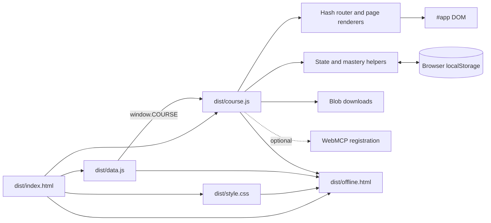
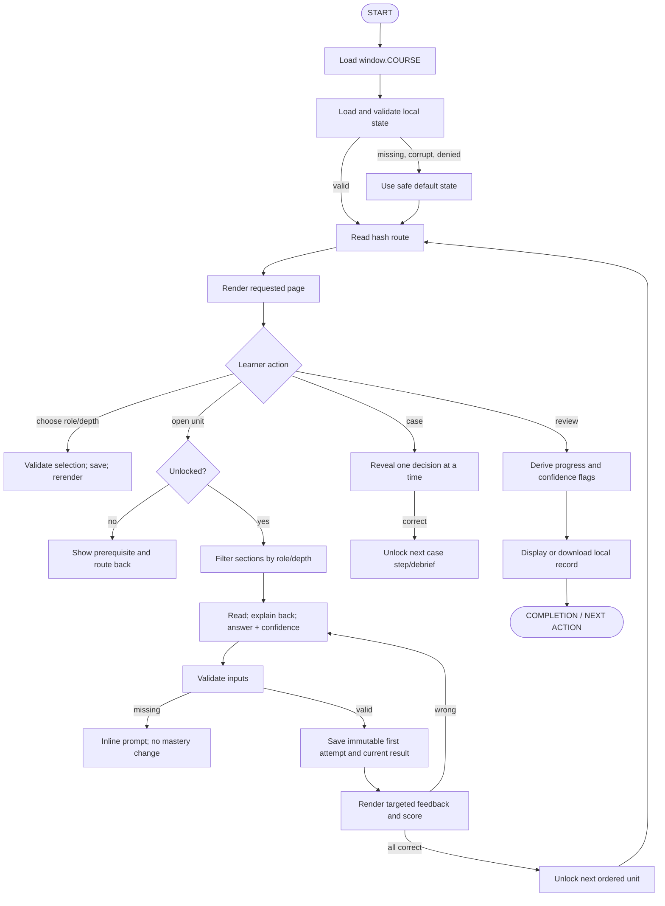
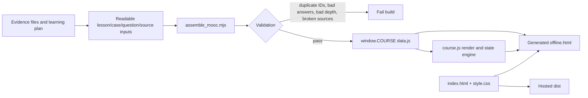

# Reference Architecture

This document reverse-engineers the final working Vikkypaedia module as the source of truth. It describes the released system, then recommends the smallest normalization needed to reproduce it for a new topic. It is not a chronology.

## 1. System purpose

The module turns an evidence corpus into a self-directed learning journey for three audiences—UG, PG, and Faculty—over a common curriculum. A learner chooses an audience and depth, works through ordered rooms, answers confidence-rated questions, unlocks the next room through mastery, practices with cases, and reviews local progress. The design aims to make a large topic feel navigable while preserving depth and source traceability.

**Inputs:** course metadata; ordered lessons; role-specific depth assignments; sources; questions; cases; faculty activity; toolkit content; learner selections and responses.

**Outputs:** personalized teaching pages; answer feedback; solved/completed/unlocked status; first-attempt and current scores; confidence flags; case progression; local notes/work; text/HTML downloads; hosted and offline editions.

**Entry points:** `#home` is primary. Hash routes also permit direct entry to baseline, lessons, cases, final practice, faculty, progress, toolkit, and sources. A locked lesson route returns a prerequisite page.

**Completion:** the implementation distinguishes a room that is **solved** (all room questions currently correct) from one that is **complete** (solved plus every role-specific Must Know section’s explain-back box checked). Sequential unlocking uses solved status. The whole course has no server-issued certificate.

## 2. Actual runtime architecture



There is no framework, server API, authentication, database, package runtime, analytics service, or environment variable in the released app. Runtime dependencies are the DOM, hash navigation, localStorage, Blob/object-URL downloads, print, and optional browser WebMCP support.

## 3. Route and screen map

The `route()` dispatcher in [`dist/course.js`](../../work/mooc-site/dist/course.js) reads `location.hash`, renders a whole page into `#app`, binds interactions, and moves focus to `#main` after navigation.

| Route | Renderer/behavior | Main input | State written |
|---|---|---|---|
| `#home` | Home/dashboard and complete course grid | lessons, current state | role/depth selectors |
| `#baseline` | Three-question starting check | `baseline` | answers/confidence |
| `#learn-{id}` | Personalized lesson and five-question room evaluation | one lesson, sources | read checks, answers, confidence, reflection |
| `#cases` | Case library | cases | none |
| `#case-{letter}` | Three sequential decisions and debrief | one case | case answers/progression, notes |
| `#final` | Role-filtered final practice | `finalQuestions` | answers/confidence |
| `#faculty` | Local pathway drafting and self-review rubric | `facultyTask` | text fields/rubric checks |
| `#progress` | Score, completion, confidence flags, per-room table | all progress state | export/reset actions |
| `#toolkit` | Source-linked practical cards and downloads | `toolkit` | download only |
| `#sources` | Provenance and caveat register | `sources` | none |
| unknown | Not-found page | hash | none |

The shell has a skip link, fixed/sidebar navigation on wide screens, a sticky top area, and a responsive main region. The home course map groups the 21 lessons into core and system-oriented parts, but this grouping is presentation configuration rather than an engine requirement.

## 4. Operational flow



### Important step behavior

| Trigger/action | Processing | State/output | Exception behavior |
|---|---|---|---|
| First load | Parse storage, validate role/depth/maps | default or restored state | parse/access failure uses defaults |
| Select role/depth | validate allowed values; update state | rerendered personalized module | invalid tool/config input returns an error |
| Open room | find lesson and call `isRoomUnlocked` | lesson or locked page | unknown ID falls through to not found |
| Filter teaching | compare depth ranks for current role | only permitted sections render | invalid depth is prevented at build and load boundaries |
| Submit answer | require selected option and confidence; compare answer index | attempts, correctness, confidence, first attempt, timestamp | missing input shows prompt; no valid submission stored |
| Retry | mark retry state then resubmit | current correctness may change | stored first attempt remains unchanged |
| Explain back | toggle `state.read[section.id]` | complete count may change | applies to visible Must sections for current role |
| Open next room | previous room’s current questions must all be correct | button/route unlock | direct URL has same guard as navigation |
| Case decision | same question mechanics plus step order | next step reveal | incorrect choice stays at current step |
| Export | derive text/guide from live data and state; create Blob | local file download | browser download capability required |
| Reset | request confirmation, clear stored state | fresh defaults | cancellation makes no change |

## 5. State, scoring, and persistence

The state key is `metabolic-child-v1`. The default shape in `dist/course.js` is:

```js
{
  version: 1,
  role: "UG",
  depth: "Must Know",
  answers: {},
  confidence: {},
  read: {},
  notes: {},
  faculty: {},
  rubric: {},
  caseSteps: {}
}
```

An answer record stores the selected option, current correctness, confidence, immutable first correctness/confidence, attempt count, and time. The engine uses stable IDs as keys; changing an ID after publication disconnects existing progress.

Core functions in `dist/course.js`:

- `load()` and `save()` handle persistence and tolerate storage errors.
- `visibleSections()` applies the role/depth rank rule.
- `roomQuestions()` normalizes evaluation access.
- `score()` derives attempted, first-time-correct, currently-correct, and total counts.
- `isRoomSolved()` checks current correctness for every room question.
- `isRoomUnlocked()` checks the previous ordered lesson, with the first lesson always open.
- `isRoomComplete()` adds required explain-back checks to solved status.
- `submit()` validates and persists assessment attempts.
- `result()` distinguishes normal and retry display states.
- `route()` and `go()` implement client-side navigation.

No learner state leaves the device. There is no account sync, server backup, cohort view, grading service, or authorization boundary.

## 6. Topic-data schema

The released [`dist/data.js`](../../work/mooc-site/dist/data.js) assigns one JSON-compatible object to `window.COURSE`.

```text
Course
├─ version: string
├─ checkedOn: string
├─ lessons: Lesson[]
├─ sources: Source[]
├─ cases: Case[]
├─ baseline: Question[]
├─ finalQuestions: Question[]
├─ facultyTask: FacultyTask
└─ toolkit: ToolkitItem[]
```

```text
Lesson { id, title, subtitle, minutes, outcomes[], sections[], takeaway,
         check?, evaluation[] }
Section { id, title, depth:{UG,PG,Faculty}, paragraphs[], points[], sourceIds[] }
Question { id, stem, options:[{text,feedback}], answer, critical, roles?, sourceIds[] }
Case { id, name, age, setting, title, intro, sourceIds[], steps[], debrief }
CaseStep extends Question with roles[], reveal; options may add consequence
Source { id, title, organization, url, date_version, verified_scope,
         access, use_in_mooc, caveat }
FacultyTask { title, prompt, fields:[{id,label,hint}],
              rubric:[{title,description}] }
ToolkitItem { label, title, points[], sourceIds[] }
```

Actual release scale: 21 lessons, 105 teaching sections, 5 evaluation questions per lesson, 4 cases with 3 steps each, 3 baseline questions, 18 final questions, 56 source records, 5 faculty fields, 5 rubric checks, and 8 toolkit cards.

The first ten source lesson records retain a legacy `check` object as well as `evaluation`; later lessons use `evaluation` only. The engine’s `roomQuestions(l) { return l.evaluation || [l.check] }` provides compatibility. A new module should use `evaluation[]` as the canonical form and omit the duplicate legacy field.

## 7. Build-time data flow



[`assemble_mooc.mjs`](../../work/assemble_mooc.mjs) merges early and later lesson JSON, room-question JSON, cases, combined sources, and additional chapter data. It adds evaluations, balances some answer positions, normalizes selected records, validates referential integrity, emits `data.js`, parses generated JavaScript with `vm.Script`, and creates the offline file and readable complete-course JSON.

Its effective validations are:

- duplicate source IDs fail;
- duplicate question IDs across lessons, baseline, final, and cases fail;
- each question must have four options and answer index 0–3;
- every question and section source ID must exist;
- every lesson must have at least four sections;
- each role’s section depth must be one of the three configured labels.

For a new module, preserve these validations but remove absolute machine paths, legacy one-off corrections, and separate topic-specific source formats. Prefer:

```text
content/course.json + content/sources.json
              ↓ validate + transform
dist/data.js + dist/offline.html + build report
```

## 8. File and folder responsibility map

```text
work/mooc-site/
├─ .openai/hosting.json      static host configuration
└─ dist/
   ├─ index.html             reusable HTML shell and asset versions
   ├─ style.css              reusable design system; brand tokens configurable
   ├─ course.js              reusable engine plus some configurable labels/routes
   ├─ data.js                generated topic-specific course data
   └─ offline.html           generated release artifact

work/
├─ assemble_mooc.mjs         build/validation pipeline; reusable pattern, topic-bound inputs
├─ make_cases.mjs            topic-specific cases, baseline, final, faculty task
├─ pcna_chapters.mjs         topic-specific lesson/source authoring input
├─ mooc_lessons_*.json       topic-specific lesson inputs
├─ mooc_room_questions.json  topic-specific assessment input
├─ combined_sources.json     generated/combined evidence register
├─ build_blueprint.mjs       evidence/content planning artifact generator
└─ apply_worldclass_unlock.py and upgrade_room_evaluations.mjs
                             historical one-time transforms; do not reuse as architecture
```

| File | Used by | Depends on | Classification |
|---|---|---|---|
| `.openai/hosting.json` | Sites hosting | `dist` path/project ID | configurable deployment |
| `dist/index.html` | browser/offline packager | CSS, data, engine | reusable shell |
| `dist/style.css` | browser/offline packager | design tokens and class contract | reusable + configurable brand |
| `dist/course.js` | browser | `window.COURSE`, browser APIs | reusable engine with config debt |
| `dist/data.js` | engine | generated course object | topic-specific generated file |
| `dist/offline.html` | learner browser | inlined release | generated optional output |
| `assemble_mooc.mjs` | author/build process | source JSON/JS and runtime templates | reusable validation pattern + topic transforms |
| `make_cases.mjs` | assembler | topic evidence IDs | topic-specific authoring |
| `build_blueprint.mjs` | authoring process | evidence and curriculum JSON, spreadsheet library | optional planning artifact |

## 9. UI behavior and reusable patterns

### Navigation and sequence

- Hash routing supports static hosting and offline navigation.
- The navigation and course map expose the whole journey.
- Unit states use text/icons/classes for locked, current, solved, and completed.
- The next-mission card resolves the next actionable step.
- Locked routes explain the prerequisite and link to it.

### Teaching and evaluation

- Lesson content is filtered by role and chosen maximum depth.
- Evidence links appear alongside claim-bearing content.
- Must-level sections can require an explain-back checkbox.
- A room evaluation shows first-time, current, and attempted statistics plus five progress dots.
- Question submission requires option and confidence, displays targeted feedback, correct-answer context, references, and retry.

### Applied learning and progress

- Cases reveal sequential decisions and consequences.
- The progress page shows unit completion, cases/final scores, a per-room table, and high-confidence incorrect answers.
- Faculty drafting fields and rubric checks persist locally.
- Toolkit, study-guide, offline-course, print, and record-download actions support reuse after the course.

### Accessibility and responsive behavior

Implemented patterns include semantic buttons/inputs, a skip link, strong `:focus-visible`, focus transfer after hash navigation, disabled states, reduced-motion rules, print styles, and breakpoints around 1100 px and 760 px. Tables and cards adapt to narrower screens.

There is no asynchronous data fetch in the runtime, so no loading spinner is necessary. Runtime error handling is intentionally small: safe storage fallbacks, validation messages for unanswered questions, locked/not-found pages, confirmation before reset, and useful empty states in progress views.

## 10. Engine, configuration, topic, and optional split

| Layer | Keep or change | Contents |
|---|---|---|
| Reusable core/engine | keep substantially stable | static shell, router, render lifecycle, safe HTML helpers, storage adapter, scoring, locks, reusable question/case/progress components, download utilities, focus/accessibility patterns, responsive/print CSS, offline packager |
| Configurable | change through one config object | title, roles, depth labels/ranks, route labels/order, unit groups, completion/unlock policies, question/confidence requirements, storage/release versions, brand tokens, feature flags, filenames, hosting metadata |
| Topic-specific | replace | outcomes, lesson sections, questions and feedback, cases, source register, local context, faculty prompt, toolkit, terminology, safety statements |
| Optional | enable deliberately | baseline, cases, final practice, faculty route, toolkit, exports, print, offline, WebMCP, external analytics/LMS/backend |

### New topic variable table

| Variable | Current value/pattern | New-topic decision |
|---|---|---|
| Course identity | Vikkypaedia metabolic-child course, version 2.2 | title, slug, promise, version |
| Audience roles | UG / PG / Faculty | roles and expectations |
| Depth taxonomy | Must / Nice / Good | labels, ranks, default |
| Unit graph | 21 sequential rooms in two groups | IDs, order, groups, prerequisites |
| Unit contract | 5 sections, 5 questions | section/question counts |
| Unlock policy | previous room currently solved | rule and threshold |
| Complete policy | solved + visible Must explain-back | requirements |
| Confidence | required per answer | choices and reporting |
| Assessment truth | first and current retained | retry/attempt policy |
| Case model | 4 fictional cases × 3 steps | cases, steps, roles |
| Evidence | 56 source records with provenance/caveats | source corpus and standard |
| Local context | India throughout | geography/system constraints |
| Faculty task | local pathway draft + rubric | applied faculty output |
| Toolkit | 8 practical cards | reusable aids |
| Navigation/routes | fixed named routes | enabled routes and labels |
| Brand system | CSS custom properties and themed components | colors, type, visual assets |
| Storage | `metabolic-child-v1`, schema 1 | unique key, schema, migration |
| Release/cache | course 2.2 and `?v=2.2` assets | synchronized version tuple |
| Downloads | record, guide, offline HTML | filenames and contents |
| Hosting | static `dist` | host/project/repository/public URL |
| External integration | optional WebMCP tools | feature flags/contracts |

## 11. Dependencies and reuse decisions

| Dependency | Why it exists | Reuse automatically? |
|---|---|---|
| HTML/CSS/vanilla JS | zero-install static delivery and small runtime | yes for this module class |
| Browser DOM/hash/location | rendering and static routes | yes |
| localStorage | account-free progress persistence | yes unless cross-device progress is required |
| Blob/object URL | local exports | only if exports are enabled |
| print API/CSS | printable toolkit/study use | optional |
| WebMCP | programmatic role/depth and progress access | optional; feature-detect |
| Node.js `fs`, `vm` | deterministic build and syntax validation | yes for the build pipeline |
| `@oai/artifact-tool` | spreadsheet evidence blueprint | no; planning artifact only |
| Sites/GitHub Pages | static publication | choose one or both per release spec |

The release needs no runtime network request after assets load. External evidence URLs are learner-initiated links. No environment variable is required by the final runtime.

## 12. Rules encoded by the final implementation

### MUST preserve

- Data loads before the engine.
- Dynamic content passes through the escape helper.
- Stable IDs drive routing, state, and source relationships.
- Role/depth values are validated at build and state load.
- Direct route access uses the same lock rule as navigation.
- First-attempt correctness/confidence is immutable across retries.
- Solved and complete remain separate concepts.
- Progress is derived from answers/read checks rather than a manually toggled unit flag.
- Offline and hosted editions share one release source.
- Source references are validated before generation.

### SHOULD preserve

- A visible course map and next action.
- Targeted feedback and confidence reflection.
- Local persistence and privacy transparency.
- Local context across scenarios and operations.
- Evidence provenance and access caveats.
- Accessible focus, reduced motion, mobile, and print behavior.

### OPTIONAL

- Current counts, labels, medical terminology, two-part grouping, exact visual theme, WebMCP tools, cases, faculty path, final practice, toolkit, and downloads.

## 13. Lessons supported by final-code evidence

1. **Freeze mastery semantics early.** `isRoomSolved`, `isRoomUnlocked`, and `isRoomComplete` now encode three distinct states. Collapsing them would produce misleading progress or incorrect locks.
2. **Generate repeated evaluations from structured input.** The final course has five questions in every room. Bulk content and validation belong before UI polish.
3. **Guard direct routes.** A disabled card alone cannot protect a hash route; the final `lesson()` path returns `lockedPage()` when needed.
4. **Preserve first attempts.** The final answer record keeps both first and current performance, enabling meaningful confidence calibration after feedback.
5. **Use editorial titles.** Publisher/source identifiers belong in provenance records, not automatically in module names.
6. **Build offline from the release.** `offline.html` is an assembled artifact. Maintaining a second code path would drift.
7. **Treat transformations as build debt.** `apply_worldclass_unlock.py` and `upgrade_room_evaluations.mjs` were useful one-time transforms but should not become the new architecture. Put their final behavior into the engine and schema.
8. **Derive all denominators.** One residual export string reports `/10` despite 21 lessons. It demonstrates why UI/export counts must come from `COURSE.lessons.length`. This is an observed reference defect; this reverse-engineering task intentionally does not alter the working module.
9. **Use portable paths.** The assembler’s absolute author-machine path works in its original workspace but should be replaced by project-root-relative resolution.
10. **Synchronize cache and release versions.** The hosted shell uses versioned asset URLs. Update HTML, course data, offline output, and deployed version together, then verify with a fresh session.

## 14. Recommended first-build structure

The released structure can be reproduced more efficiently with this topic-neutral source layout:

```text
new-module/
├─ module.config.json
├─ content/
│  ├─ course.json
│  └─ sources.json
├─ src/
│  ├─ index.html
│  ├─ course.js
│  └─ style.css
├─ scripts/
│  └─ build.mjs
└─ dist/
   ├─ index.html
   ├─ data.js
   ├─ course.js
   ├─ style.css
   └─ offline.html
```

The build script should validate canonical inputs, copy/version reusable assets, generate `window.COURSE`, create the offline edition, and emit a concise build report. Keep generated files out of the authoring workflow except for review and deployment.

## 15. Ideal build order and stage gates

| Stage | Know first | Create now | Do not create yet | Acceptance gate |
|---|---|---|---|---|
| 1. Requirements | outcome, roles, depth, delivery | filled specification | screens or bulk content | no unresolved structural variable |
| 2. Curriculum/evidence | topic boundary, evidence standard | source register, unit/outcome map | polished prose | every outcome has evidence coverage |
| 3. Contract | unit and assessment rules | schemas, validator, fixtures | all units | bad fixtures fail; good fixture passes |
| 4. Core journey | route graph and states | shell, router, one-unit renderer | optional routes | direct/load/keyboard/mobile work |
| 5. Mastery | solved/unlocked/complete semantics | scoring, confidence, retry, persistence | visual refinements | state end-to-end tests pass |
| 6. Full content | validated contract | all topic data | deployment | schema, references, alignment pass |
| 7. Optional paths | enabled feature list | cases/final/faculty/toolkit | unused features | every enabled route has complete flow |
| 8. Design/accessibility | stable content/components | final CSS and states | release | responsive, keyboard, focus, print pass |
| 9. Packaging | release version tuple | generated dist and offline | publication | online/offline parity and syntax pass |
| 10. Release | repo/host/public URL | commit/deployment | claims of success | fresh-browser learner journey passes |

This order minimizes rework because bulk authoring begins only after the contract and one complete learning journey have passed.
